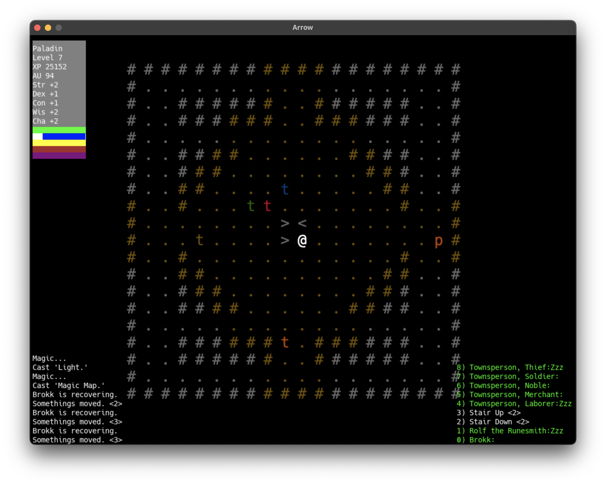

# random.hs

Create Advanced Characters for Arrow roguelike. Arrow roguelike is
currently under second year of development and will be released
when ready.

&mdash; [Arrow](https://github.com/joelelmercarlson/arrow)

## Howto
```cp player.yaml $HOME/Documents/Arrow```

## Requirements
&mdash; Arrow >= 0.4.5.0

## Screenshot


## Usage
```
❯ stack exec arrow-rpg elf druid
Name:  Torendil | Gender: Male
Age: 115 | Height: 5'10" | Hair: Yellow Blond | Eyes: Jet
Mark: nil 

Armor Class 14 (armor/Leather)
Hit Points 9
Mana Points 6

Elf Druid, Str=+0, Dex=+3, Con=+1, Wis=+1, Cha=-1

M:melee/Sickle
S:shoot/Sling
Zap:1d8
```

## Requirements
&mdash; [stack](https://haskellstack.org/)

## Author
"Joel E Carlson" &lt;joel.elmer.carlson@gmail.com&gt;
