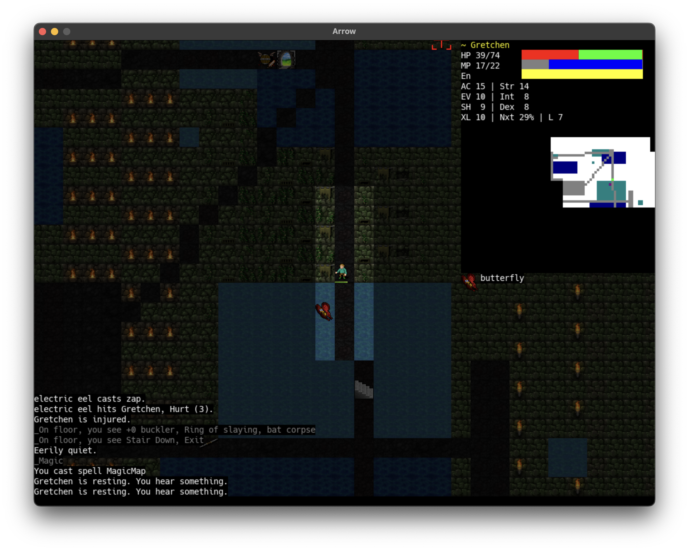

# Arrow24

Arrow24 utilizes the Arrow roguelike engine.

## Table of Contents
- [Abstract](#abstract)
- [Inspiration](#inspiration)
- [Features](#features)
  - [Archtypes](#archtypes)
  - [Species](#species)
  - [Elemental](#elemental)
  - [Arcane](#arcane)
  - [Random](#random)
- [Usage](#usage)
- [Requirements](#requirements)
- [Author](#author)

## Abstract
Arrow24 is a roguelike developed in Haskell with SDL2. This
project was inspired by RogueBasin Tutorials. Arrow gameplay comprises
of the Player '@' and a Generic Fantasy World. The World is complete
with Magic, Monsters, and Items to challenge '@'. The goal
is to explore and have Fun!

### Inspiration
&mdash; [RogueBasin.com](http://www.roguebasin.com/index.php/How_to_Write_a_Roguelike_in_15_Steps)

&mdash; [Angband](https://github.com/angband/angband)

&mdash; [Crawl](https://github.com/crawl/crawl)

&mdash; [RLTiles](https://rltiles.sourceforge.net)

### Screenshot


### Town


### Dungeon


## Features
'@' is your character in a classical fantasy world. Arrow gameplay
is focused on Melee, Shoot, and Zap. The elements of the world 
are wielded with powerful Magic.

### Archtypes
&mdash; `Cleric`, `Fighter`, `Rogue`, and `Wizard`

Archtypes and experience levels determine '@' skills: `Melee`,
`Shoot`, and `Zap`.

### Species
&mdash; `Elf`, `Dwarf`, `Halfling`, and `Human`

Species determine '@' initial abilities: `Strength`, `Dexterity`,
and `Intelligence`.

### Elemental
&mdash; `Acid`, `Cold`, `Fire`; and `Lightning`

### Arcane
&mdash; `Necrotic`, `Radiant`, and `Force`

### Random
&mdash; [Random](https://github.com/joelelmercarlson/Random) for '@' creation.

## Usage

&mdash; WASD keys or Arrow Key Movement

&mdash; `f` to `Fire`

&mdash; `g` to `Get`

&mdash; `i` to `Inventory`

&mdash; `p` to `Dig` in the `Dungeon`

&mdash; `r` to `Use`, `Potion`, and `Scroll`

&mdash; `t` to `Throw`

&mdash; `v` to `Target`

&mdash; `x` to `Examine`

&mdash; `z` to `Magic`

&mdash; `7` to `Portal,` `Stair`

&mdash; `8` to `Store`

&mdash; `9` to `Drop`

&mdash; `0` to `Wield`

## Requirements
&mdash; [stack](https://haskellstack.org/)

&mdash; [SDL2](https://libsdl.org/)

&mdash; save games live in ```$HOME/Documents/Arrow```

## Author
"Joel E Carlson" &lt;joel.elmer.carlson@gmail.com&gt;
